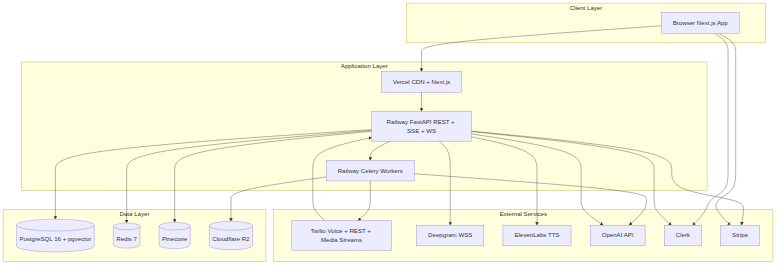
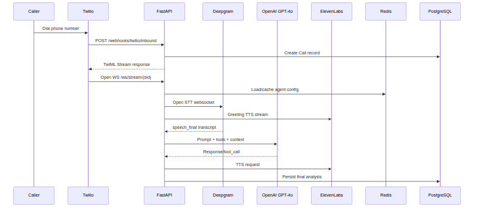
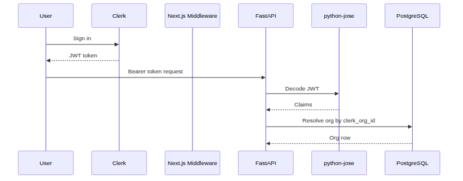
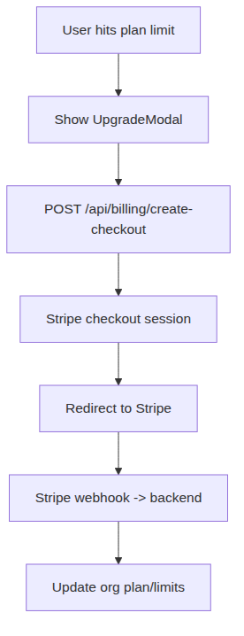
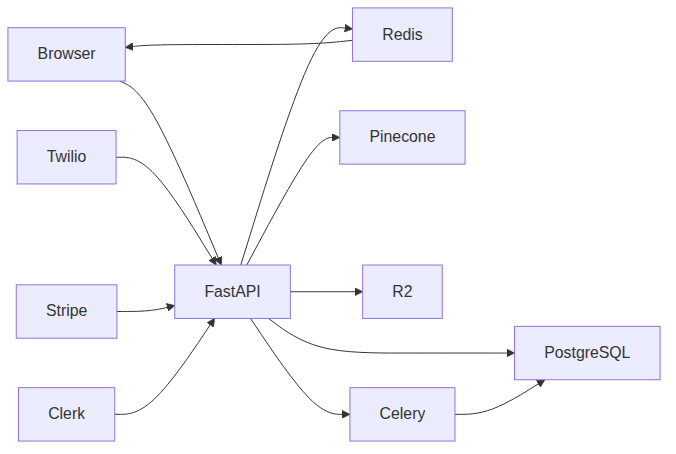
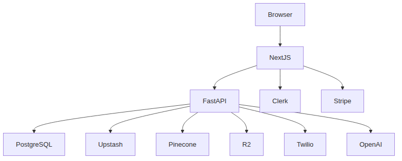
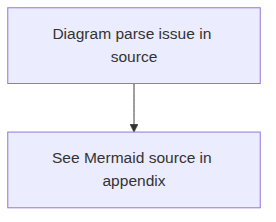

# Grace AI

Grace AI is a multi-tenant AI Voice Calling SaaS platform for inbound/outbound phone automation, campaign execution, customer engagement, scheduling, analytics, and billing.

It combines real-time telephony and AI orchestration with a modern web dashboard:
- Next.js frontend for operations and monitoring
- FastAPI backend for APIs, webhooks, and voice stream coordination
- Celery workers for asynchronous/background workloads

---

## What This Project Does

Grace AI enables teams to:
- Create and manage AI voice agents
- Handle inbound and outbound calls
- Run outbound call campaigns
- Manage customer conversations (call/email/sms context)
- Auto-book and track appointments/jobs
- Analyze performance and usage
- Manage subscription plans and billing

---

## Core Technology Stack

### Main technologies used heavily
- **Frontend:** Next.js 14, TypeScript, Tailwind CSS
- **Backend:** FastAPI (Python), SQLAlchemy, Alembic
- **Data:** PostgreSQL, Redis
- **Async processing:** Celery
- **Voice + AI:** Twilio, Deepgram, OpenAI GPT-4o, ElevenLabs
- **Auth + Billing:** Clerk, Stripe
- **Knowledge + Storage:** Pinecone, Cloudflare R2

### Supporting technologies
- Zustand, TanStack Query, Recharts, React Flow, Framer Motion
- Docker / Docker Compose
- Railway + Vercel deployment model

---

## High-Level Architecture

1. User interacts with dashboard (web app)
2. Web calls backend REST/SSE/WebSocket APIs
3. Backend handles org-scoped logic and persistence
4. Twilio webhooks + media streams trigger live voice pipeline
5. AI services (STT/LLM/TTS) drive real-time responses
6. Workers process campaigns and post-call jobs asynchronously

### Architecture Diagram


---

## How Everything Works

### 1) Authentication and Multi-tenancy
- Clerk JWT (or dev-mode fallback) authenticates users
- Organization (`org_id`) scopes all critical data access
- Middleware/dependencies enforce route protection and tenant boundaries

### 2) Voice Call Pipeline
- Twilio hits webhook for inbound/outbound call setup
- FastAPI creates call records and returns TwiML stream instructions
- Audio stream is transcribed (Deepgram), reasoned (OpenAI), synthesized (ElevenLabs), and streamed back to caller
- Call transcripts and outcomes are persisted and post-processed

### 3) Campaign Pipeline
- Users create campaign with agent + contacts
- Campaign launch enqueues tasks in Celery
- Worker dials contacts via Twilio and updates call/campaign state

### 4) Customer + Inbox + Schedule
- Customers and conversation threads are unified for timeline tracking
- AI/human message events can create/update appointment jobs
- Job status transitions are tracked for operations visibility

### 5) Billing and Plans
- Stripe checkout/portal handles subscription lifecycle
- Stripe webhooks update org plan limits and usage behavior
- Usage endpoints expose limits and consumption to dashboard

---

## Project Structure

```text
apps/
  web/        # Next.js dashboard frontend
  api/        # FastAPI backend, workers, voice pipeline, models, routers
docs/         # Consolidated technical documentation
_scratch/     # Generated docs/diagram artifacts
scripts/      # Utility scripts
```

Important backend locations:
- `apps/api/main.py` - API bootstrap + router registration
- `apps/api/routers/` - feature/API endpoints
- `apps/api/models/` - DB schema models
- `apps/api/workers/` - Celery tasks
- `apps/api/voice/` - real-time voice orchestration

Important frontend locations:
- `apps/web/app/` - route-based pages
- `apps/web/components/` - shared UI
- `apps/web/lib/` - API client/hooks/config

---

## Local Development Quick Start

1. Copy env values from `.env.example`:
   - `apps/api/.env`
   - `apps/web/.env.local`
2. Start data services:
   - `docker-compose up -d postgres redis`
3. Start the full local stack:
   - `bash scripts/restart-all.sh --watch`
   - or `npm run start` from the project root
4. Run API only:
   - `cd apps/api && uvicorn main:app --reload`
5. Run worker only:
   - `cd apps/api && celery -A workers.celery_app worker --loglevel=info -Q campaigns,post_call`
6. Run web only:
   - `cd apps/web && npm run dev`

---

## Deployment Guide

### Prerequisites
- Railway account + CLI
- Vercel account + CLI
- Twilio account and number
- ElevenLabs, Deepgram, OpenAI API keys
- Clerk app (Organizations enabled)
- Stripe products + webhook secret
- Pinecone index (`1536`, cosine)
- Cloudflare R2 bucket

### Steps
1. Provision PostgreSQL + Redis on Railway
2. Deploy FastAPI API service (`apps/api`)
3. Deploy Celery worker service (same image, worker command)
4. Run migrations (`alembic upgrade head`)
5. Configure Twilio webhooks:
   - `POST /webhooks/twilio/inbound`
   - `POST /webhooks/twilio/status`
6. Deploy Next.js on Vercel (`apps/web`)
7. Configure Stripe webhook:
   - `POST /webhooks/stripe`
8. Verify health and key user flows

---

## API and Health Checks

- Health endpoint: `GET /health`
- Example expected response:
  `{"status":"ok","db":"connected","redis":"connected"}`

Recommended post-deploy validations:
- Sign in and org access
- Agent creation/update
- Outbound test call
- Campaign launch
- Live stream updates
- Billing checkout and webhook state update

---

## Monitoring Recommendations

Suggested alert baselines:
- API 5xx error rate > 1% (5 min)
- Voice websocket disconnect rate > 20% (10 min)
- Celery task failures > 5 (10 min)

---

## Diagrams

### 1) System Architecture


### 2) Voice Call Flow


### 3) Outbound Campaign Flow


### 4) Authentication Flow


### 5) Billing Flow


### 6) Platform Data Flow


### 7) Deployment Topology


### 8) Database ERD


---

## Related Documents

- Consolidated deep documentation: `docs/ALL-IN-ONE.md`
