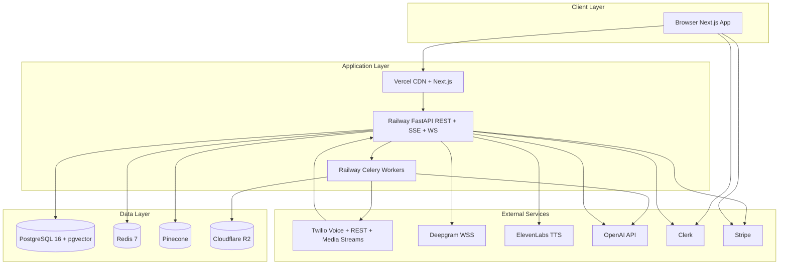
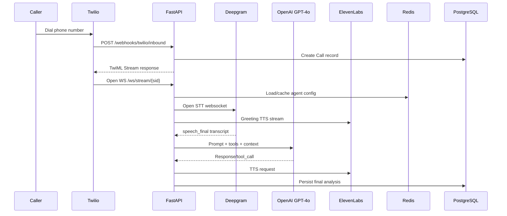
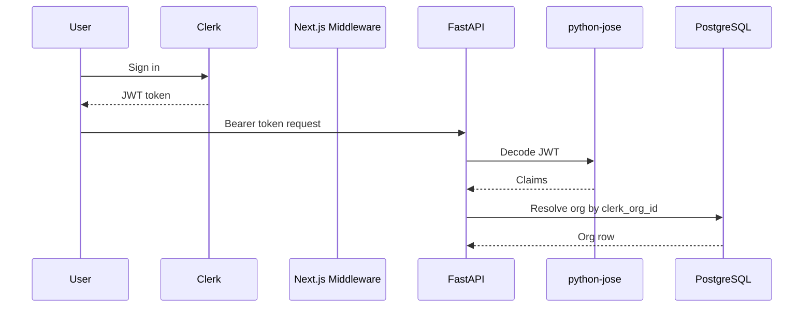
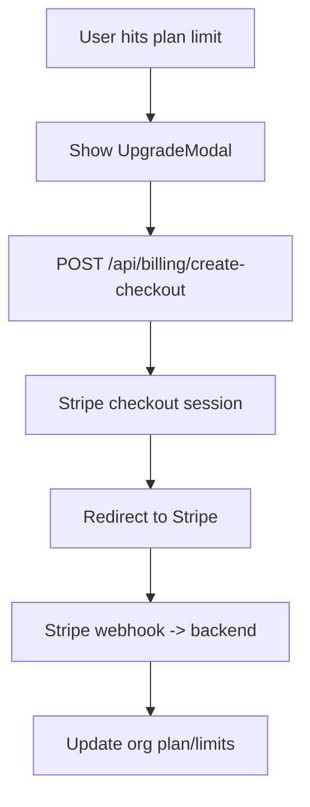
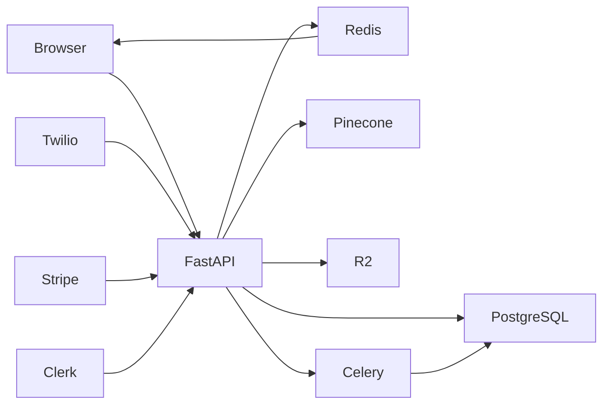
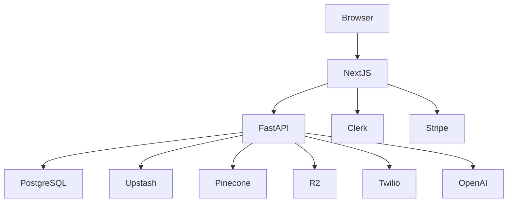

# Grace AI — All Documentation In One File

This file is a single consolidated view so you do not need to jump between `docs/*.md` files.

---

## 1) Overview

Grace AI is a multi-tenant AI Voice Calling SaaS that lets organizations create and run AI voice agents for inbound and outbound calling. Agents use Twilio for telephony, Deepgram for STT, GPT-4o for reasoning/tool calls, and ElevenLabs for TTS. The product supports appointment booking, lead capture, follow-up messaging, analytics, and plan-based billing.

### Problem
Businesses miss calls and lose leads due to limited staffing and inconsistent call handling. Grace AI automates repetitive call center work while keeping 24/7 availability.

### Target users
- SMB operations teams
- Sales campaign teams
- Customer support teams

### Core capability set
- AI agents
- Inbound and outbound calling
- Appointment booking
- Lead capture
- SMS follow-ups
- Knowledge base grounding
- Real-time monitoring
- Analytics and billing

---

## 2) Architecture

### Layers
1. **Frontend**: Next.js App Router, TypeScript, Tailwind, shadcn/ui
2. **Backend API**: FastAPI async service, org-scoped routes, webhooks
3. **Voice pipeline**: FastAPI websocket media-stream orchestration
4. **Workers**: Celery queues (`campaigns`, `post_call`)
5. **Data/services**: PostgreSQL, Redis, Pinecone, R2

### Request flow
Browser -> axios (JWT/request-id) -> FastAPI deps (`get_current_user`, `get_current_org`) -> org-scoped DB query -> JSON response.

### Multi-tenancy
- Every core data entity is org-scoped (`org_id`)
- Redis channels/keys namespaced by org
- Vector store partitioning by org/agent namespace

---

## 3) Technology Stack

### Frontend
- Next.js 14
- TypeScript
- Tailwind CSS
- shadcn/ui
- Zustand
- TanStack Query
- Framer Motion
- React Flow
- Recharts
- axios

### Backend
- Python 3.12
- FastAPI
- SQLAlchemy 2.0
- Alembic
- Pydantic v2
- asyncpg
- Celery
- slowapi
- structlog

### Voice + AI
- Twilio Voice + Media Streams
- Deepgram
- OpenAI GPT-4o
- ElevenLabs
- LangChain

### Data + storage
- PostgreSQL 16 + pgvector
- Redis 7
- Cloudflare R2
- Pinecone

### Auth + billing
- Clerk
- Stripe

### Infra
- Railway
- Vercel
- Docker
- GitHub Actions
- Upstash

---

## 4) Voice Pipeline (Deep Dive)

### Inbound flow
1. Inbound webhook from Twilio.
2. Validate signature + resolve org/agent.
3. Create call record.
4. Return TwiML stream.
5. Open websocket for media.
6. Stream caller audio to Deepgram.
7. Build message history + optional RAG context.
8. Call GPT-4o (with tools).
9. Convert response to speech using ElevenLabs.
10. Stream audio back to caller via Twilio.
11. On call end: status webhook + post-call processing.

### Latency target
Total turn latency target: under ~800ms, with STT + retrieval + LLM + TTS tuned for realtime responsiveness.

### Tool calling
- `book_appointment`
- `capture_lead`
- `send_sms`
- `transfer_to_human`
- `end_call`

---

## 5) Database Schema (Core Entities)

### Core tables
- `organizations`
- `agents`
- `calls`
- `contacts`
- `campaigns`
- `kb_documents`
- `appointments`
- `sms_logs`

### Redis patterns (used in app)
- `call:{org_id}:{call_sid}:messages`
- `agent:{agent_id}`
- `ratelimit:calls:{org_id}`
- `live_calls:{org_id}`
- `live_inbox:{org_id}`
- `live_sms:{org_id}`
- `org:{org_id}:minutes_today`

### Performance
- Async pool + pre-ping configured
- Indexes for high-traffic call/contact lookups
- List routes use limits/pagination patterns

---

## 6) API Reference (Grouped)

### Agents
- `GET /api/agents`
- `POST /api/agents`
- `GET /api/agents/{id}`
- `PUT /api/agents/{id}`
- `DELETE /api/agents/{id}`
- `PUT /api/agents/{id}/flow`
- `POST /api/agents/{id}/assign-number`
- `POST /api/agents/{id}/test-call`

### Calls
- `GET /api/calls`
- `GET /api/calls/{id}`
- `GET /api/calls/active`
- `POST /api/calls/outbound`

### Customers/Contacts
- `GET /api/customers`
- `POST /api/customers`
- `PUT /api/customers/{id}`
- `DELETE /api/customers/{id}`
- `GET /api/customers/{id}/timeline`
- `POST /api/customers/import`

### Campaigns
- `GET /api/campaigns`
- `POST /api/campaigns`
- `GET /api/campaigns/{id}`
- `PUT /api/campaigns/{id}/start`
- `PUT /api/campaigns/{id}/pause`
- `GET /api/campaigns/{id}/stats`

### Knowledge base
- `GET /api/knowledge-base/{agent_id}`
- `POST /api/knowledge-base/upload`
- `DELETE /api/knowledge-base/{doc_id}`
- `POST /api/agents/{id}/kb-from-question`

### Numbers, analytics, billing, live, webhooks, system
- `/api/phone-numbers/*`
- `/api/analytics/*`
- `/api/billing/*`
- `/api/live/stream`
- `/webhooks/twilio/*`
- `/webhooks/stripe`
- `/health`

---

## 7) Auth & Multitenancy

- Clerk-driven auth in production mode
- Dev-safe fallback when Clerk key is invalid
- Organization mapping through `clerk_org_id`
- Role model: `admin`, `member`
- Strict org-scoped data isolation for DB and realtime channels

---

## 8) Billing & Plans

### Plans
- Free, Starter, Pro, Enterprise with increasing limits

### Billing lifecycle
1. User initiates checkout
2. Stripe session created
3. Redirect to Stripe Checkout
4. Stripe webhook updates org plan/limits
5. Frontend usage/plan gates refresh

### Metering
- Minute usage tracked against plan caps
- Enforcement checks happen in backend before expensive operations

---

## 9) Frontend Structure

### Main dashboard tabs
- Inbox, Schedule, Jobs, Customers, Agent, Calls, Campaigns, Settings

### State approach
- TanStack Query for server state
- Local component state for form/filters
- Optional Zustand for UI state

### Realtime
- SSE EventSource from `/api/live/stream`
- Sync status polling of `/health`

### Offline continuity
- localStorage fallback for Customers/Schedule in outage scenarios
- sync queue flushes pending records after reconnect
- unsynced rows marked with `Local` badge

---

## 10) Deployment & Infra

### Service map
- Web: Vercel
- API: Railway
- Workers: Railway
- DB: PostgreSQL
- Cache/broker: Redis
- Vector: Pinecone
- Object storage: R2

### Local boot
```bash
docker-compose up -d
cd apps/api && python3 check_env.py
cd apps/api && alembic upgrade head
bash scripts/restart-all.sh --watch
```

---

## 11) Security

- Signed webhook verification (Twilio/Stripe)
- CORS restriction to configured frontend origin
- Rate limiting on sensitive routes
- Input validation via typed schemas
- Tenant isolation by `org_id` guardrail

---

## 12) Developer Guide

### Prerequisites
- Node.js 20+
- Python 3.12+
- Docker
- ngrok (for local webhook testing)

### Testing
```bash
cd apps/api && pytest --tb=short -v
cd apps/web && npx tsc --noEmit
cd apps/web && pnpm vitest run
```

---

## 13) Architecture Diagrams (Embedded Mermaid Sources)

### 01-system-architecture


### 02-voice-call-flow


### 03-outbound-campaign-flow
```mermaid
flowchart TD
  A[User creates Campaign] --> B[Select Agent + Contacts + Schedule]
  B --> C[PUT /api/campaigns/{id}/start]
  C --> D[FastAPI status=running]
  D --> E[Enqueue Celery dial tasks]
  E --> F[For each contact with spacing]
  F --> G[Celery -> Twilio calls.create]
  G --> H[Twilio dials contact]
  H --> I{Call outcome}
  I -->|Answered| J[Enter normal voice pipeline]
  I -->|No answer| K[outcome = no-answer]
  I -->|Voicemail/AMD| L[Leave voicemail message]
  J --> M[Post-call worker]
  K --> M
  L --> M
  M --> N[Campaign.calls_made increment]
  N --> O{All contacts dialed?}
  O -->|No| F
  O -->|Yes| P[Campaign.status = completed]
```

### 04-database-erd
See full ERD in `docs/diagrams/04-database-erd.mermaid`.

### 05-auth-flow


### 06-billing-flow


### 07-data-flow


### 08-deployment-architecture


---

If you want, I can also generate this as a `.docx` export format next (Word document) with the same structure.

